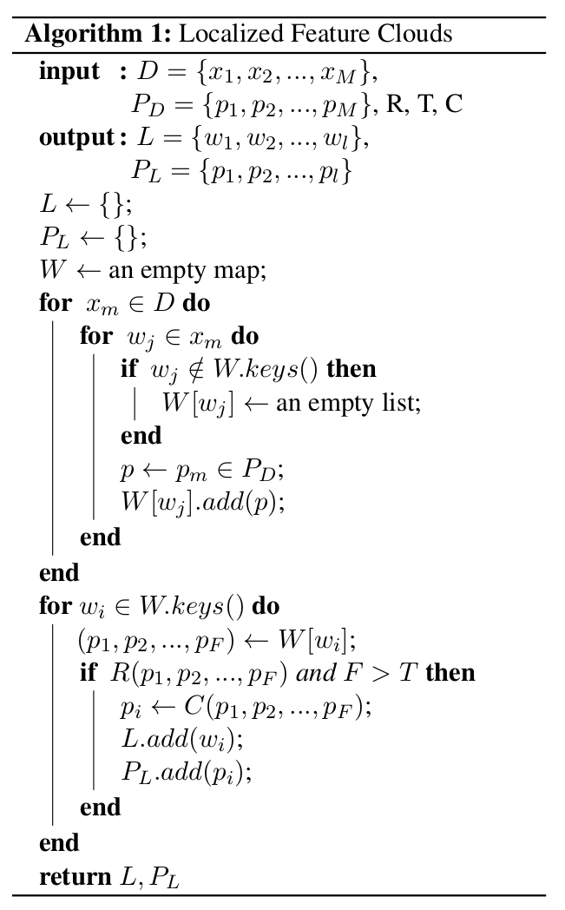

# SemLa: A Visual Analysis System for Fine-grained Text Classification

This repository contains the source code for the demonstration of the visual analytics system SemLa (Semantic Landscape).

SemLa is a tool for analyzing fine-grained text classification models, which is particularly motivated by the special challenges posed by the natural language processing task of intent recognition.

**Our demo is available at** [https://munkhtulgab.github.io/SemLa/](https://munkhtulgab.github.io/SemLa/).

**License**: [BSD 3-Clause](https://github.com/MunkhtulgaB/SemLa/blob/main/LICENSE)

<hr>

## Cite us

```
@inproceedings{Battogtokh2024,
  author={Battogtokh, Munkhtulga and Davidescu, Cosmin and Luck, Michael and Borgo, Rita},
  booktitle={The Proceedings of The 38th Annual AAAI Conference on Artificial Intelligence}, 
  title={SemLa: A Visual Analysis System for Fine-grained Text Classification}, 
  year={2024},
}
```
<hr>

## Our algorithm for computing the locality of features

Localized Feature Clouds (LFC) interactively complement the map with a layer of visual summary that immediately reveals patterns about various localities in the _currently_ visible space (the results change as the user zooms or pans). LFC is different from traditional word clouds in that the features are positioned semantically in the embedding space.

The patterns identified by this technique, which we refer to as _local features_, can be in terms of not only words but also _any_ other type of feature that may be extracted from the samples (e.g., n-grams, named entities, concepts, extracted sentiments, etc.). Therefore LFC is a highly extensible technique that can potentially be useful for any task that uses spatial representations of data instances.



The pseudocode above describes the LFC algorithm. LFC outputs a set of $l$ _local features_ $L = \{w_1, w_2, \ldots, w_l\}$ and their corresponding positions $P_L = \{ p_1, p_2, \ldots, p_l \}$ in a space $S$ given inputs that include $M$ samples $D = \{x_1, x_2, ..., x_M\}$ and their positions $P_D = \{p_1, p_2, \ldots, p_M\}$ in $S$. A local word $w_i$ is extracted from the samples in $D$, if and only if the positions of _all_ the $f$ samples that contain $w_i$ are determined as _localized_ by an input criterion function $R(\cdot)$, _and_ the frequency $f$ of $w_i$ is greater than a given threshold $T$. Then, the position of each local word $w_i$ is finally determined by another input function $C(\cdot)$ that computes a single position from the list of positions that correspond to $w_i$. 

We use two different locality functions that each constructs a _shape_ (enclosure) that contains some or all of the input positions and returns true if the size of that shape is below a threshold parameter $T_{locality}$.
The first, **square** locality function $R_{square}$ returns true if the condition in Equation 1 holds for each $j$-th dimension in $S$ (Equation 2 defines $r_j$, the range of values along dimension $j$, where $p_{ij}$ denotes the $j$-th dimension of a position $p_i$ in the set of input positions $P_{in}$). In a $Q$-dimensional $S$, this means that all the positions in $P_{in}$ can be contained within a hypercube with a side length of $T_{locality}$. For example, in 2D, this means that positions are contained within a _square_ of size $T_{locality} \times T_{locality}$.

**Equation 1:** $r_j < T_{locality}$

**Equation 2:** $r_j = \max_{p_i \in P_{in}} p_{ij} - \min_{p_i \in P_{in}} p_{ij}$

The second, **Gaussian** locality function, $R_{gaussian}$ offers a relaxation of the $R_{square}$ alternative by making it possible to ignore outliers. This function assumes that the positions are distributed in a Gaussian distribution along each $j$-th dimension in $S$, that is $p_{ij} \sim N(\mu_j, \sigma_j^2)$ where $\mu_j$ and $\sigma_j$ are respectively the mean and standard deviation of $p_{ij}$ values of all $p_i \in P_{in}$. It returns true if the condition in Equation 3 holds for each $j$. By the property of Gaussian distributions, this function ensures that a certain percentage of the positions are contained within a hypercube with a side length of $T_{locality}$. For example, if the function parameter $b = 4$, this ensures that roughly 95\% of the positions in $P_{in}$ are contained within such a hypercube (since the range $[\mu - 2\sigma, \mu + 2\sigma]$, which is $4\sigma$ wide, contains roughly 95\% of the samples in a Gaussian distribution with mean $\mu$ and standard deviation $\sigma$).

**Equation 3:** $b\sigma_j < T_{locality}$

The two locality functions above have their corresponding _centering functions_ $C_{square}$ and $C_{gaussian}$ that aim to return the center of the set of positions $P_{in}$. The former returns a position $p_{c_1}$ with the $j$-th dimension value set as given by Equation 4. The latter returns $p_{c_2}$ with each $j$-th dimension set simply to their corresponding mean $\mu_j$.

**Equation 4:** $p_{c_1j} = \min_{p_i \in P_{in}} p_{ij} + \frac{r_j}{2}$

<hr>

Copyright © 2023 Munkhtulga Battogtokh


